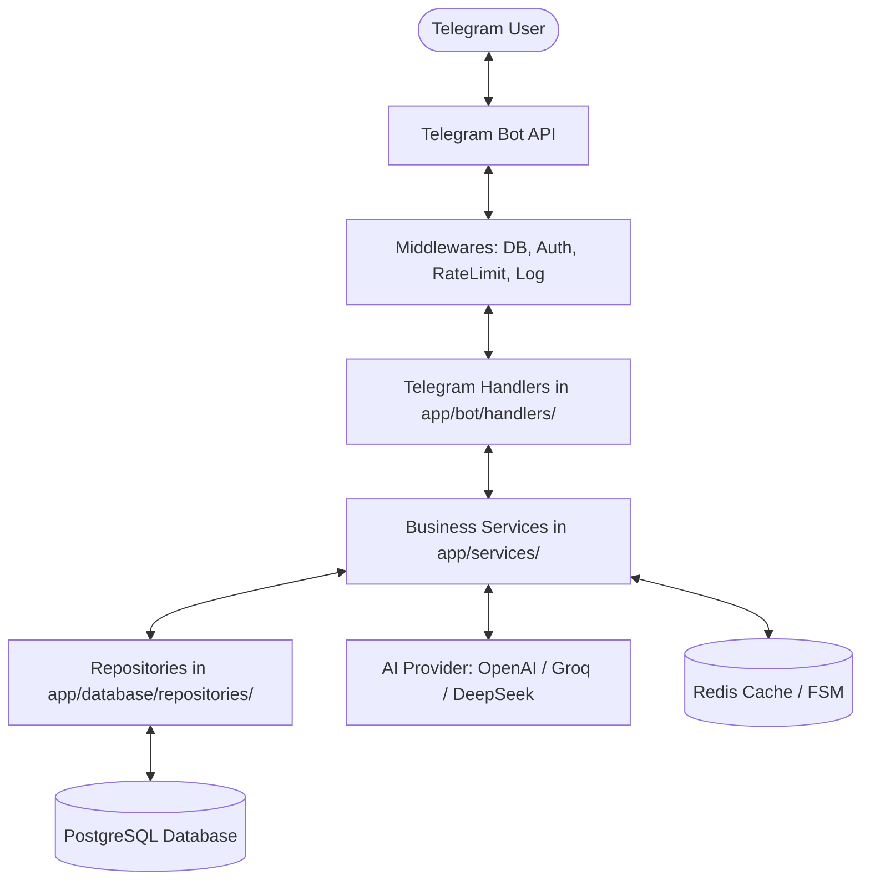

# 🎓 StudyFlow — Professional AI Study Telegram Bot

[](https://www.python.org/downloads/)
[](https://docs.aiogram.dev/)
[](https://www.sqlalchemy.org/)
[](https://www.postgresql.org/)
[](https://redis.io/)
[](https://www.docker.com/)
[](https://github.com/astral-sh/ruff)
[](LICENSE)

> **StudyFlow** is an enterprise-ready, AI-powered personal study assistant built exclusively for **Telegram**. It helps students organize their academic lives, generate dynamic multiple-choice quizzes, schedule daily study tasks, learn interactively from PDF documents, maintain consistency streaks, and level up through structured gamification.

---

## 📑 Table of Contents

- [Overview & Key Features](#-features)
- [Tech Stack](#-tech-stack)
- [Architecture & Design Principles](#-architecture)
- [Main User Interface & Menu](#-main-user-interface)
- [Installation & Local Setup](#-installation)
- [Environment Configuration](#-environment-variables)
- [Docker Deployment](#-docker-deployment)
- [Database & Migrations](#-database--migrations)
- [Automated Testing](#-testing)
- [Security & Production Readiness](#-security--production-readiness)
- [Screenshots & Visual Mockups](#-screenshots--bot-ui)
- [Demo Guide](#-demo-instructions)
- [Project Structure](#-project-structure)
- [Future Improvements](#-future-roadmap)
- [License](#-license)

---

## 🌟 Features

### 1. 📚 Subject & Topic Mastery
- Create, rename, and manage academic subjects (Mathematics, Programming, History, etc.).
- Break subjects down into discrete sub-topics with progress tracking.
- Track completion percentages per subject dynamically.

### 2. 🤖 Context-Aware AI Assistant
- Integrated OpenAI-compatible AI tutor (OpenAI, DeepSeek, Groq, OpenRouter, LocalAI).
- Supports specialized prompt modes: **Explain**, **Summarize**, **Practical Examples**, **High-Yield Study Notes**, and **Step-by-Step Reasoning**.
- Maintains bounded conversational context without token bloat or infinite memory leak.
- Token cost controls, input truncation, and per-user sliding-window rate limiting.

### 3. 📝 Interactive AI Quiz Generator
- Generate multiple-choice quizzes on-demand for any subject or general topic.
- Customizable difficulty: 🟢 **Easy**, 🟡 **Medium**, 🔴 **Hard**.
- Question volume presets (3, 5, 10 questions).
- Real-time answer validation with detailed academic explanations for correct and incorrect answers.
- Comprehensive end-of-quiz scorecards with XP rewards and badge unlocks.

### 4. 📅 AI-Generated Daily Study Plans
- Transform high-level study goals (e.g., *"Prepare for algorithms exam"*) into a timed daily agenda.
- Interactive task list: tap any task to mark as completed.
- Completing tasks awards XP, increments daily streaks, and triggers achievement checks.

### 5. 🎯 Smart Goals & Milestones
- Set long-term or short-term study goals with calendar deadlines.
- Track goal progress in 25% increments or mark complete directly for a +100 XP milestone boost.

### 6. 🔥 Healthy Study Streaks
- Daily streak tracker reinforcing consistency without promoting toxic all-nighters or burnout.
- Automatic evaluation: increments if studied on consecutive days, stays intact if already studied today, safely resets if a day was missed.

### 7. ⏱ Focus Mode (Pomodoro Timer)
- Study timers with presets: 15 min, 25 min (Pomodoro), 45 min, and 5 min rest breaks.
- Background session tracking, study time logging, and +1 XP awarded per focused minute.

### 8. 📄 Interactive PDF Document Learning
- Send any PDF lecture slide, research paper, or textbook (up to 10 MB).
- In-memory text extraction using `pypdf`.
- **Summarize**: Generate executive takeaways and key definitions.
- **Q&A**: Ask detailed questions directly against the document text.
- **Generate Quiz**: Create practice multiple-choice questions extracted directly from the document.

### 9. 🏆 Gamification, Levels & Leaderboard
- **XP Progression**: Earn XP across quizzes, study sessions, task completions, and streaks.
- **Dynamic Leveling**: $\text{Level} = \lfloor\sqrt{\text{XP} / 100}\rfloor + 1$.
- **Achievement Badges**: First Quiz, First Study Session, 7-Day Streak, 1000 XP Club, Task Conqueror, Goal Achiever.
- **Weekly Leaderboard**: Privacy-safe ranking displaying top learners.

### 10. ⏰ Automated Study Reminders
- Daily study reminders matching the user's preferred time and timezone.
- Async background scheduler with non-blocking execution.

### 11. 🎁 Referral System
- Unique referral deep links (`https://t.me/<bot>?start=ref_<telegram_id>`).
- Earn +50 XP for every friend who joins.
- Built-in anti-abuse prevention against self-referrals and duplicate links.

### 12. 🛡 Admin Management & Broadcast
- Dedicated `/admin` dashboard restricted by Telegram IDs.
- Real-time analytics: total users, 7-day active users, new users today, quizzes completed, study sessions, AI calls, and PDF documents.
- Safe broadcast engine: paced message distribution avoiding Telegram rate limit bans and gracefully skipping blocked users.
- User moderation: ban and unban controls.

### 13. 🌐 Multilingual Support (i18n)
- Native internationalization architecture:
  - 🇺🇿 **Uzbek (O'zbekcha)**
  - 🇬🇧 **English**
  - 🇷🇺 **Russian (Русский)**
- Expandable dictionary structure ready for additional language additions.

---

## 🛠 Tech Stack

| Layer | Technology | Description |
|---|---|---|
| **Language** | Python 3.12+ | High-performance asynchronous Python |
| **Bot Framework** | Aiogram 3.31+ | Fast asyncio-based Telegram Bot framework |
| **Database** | PostgreSQL 16 | Relational persistence with JSON and UUID support |
| **ORM & Async DB** | SQLAlchemy 2.0 + asyncpg | Full async DB sessions and declarative mapped models |
| **Migrations** | Alembic 1.19+ | Autogenerated, reversible schema version control |
| **Caching & FSM** | Redis 7 + redis-py | State machine storage and sliding-window rate limiting |
| **Configuration** | Pydantic Settings v2 | Strict environment validation and typing |
| **AI Integration** | OpenAI Python SDK | Standardized client compatible with any OpenAI-style endpoint |
| **Document Processing** | PyPDF 6.x | Fast, native PDF parsing and text extraction |
| **Code Quality** | Ruff & Pytest | Strict linting, formatting, and asynchronous testing |
| **Containerization** | Docker & Compose | Multi-container automated provisioning |

---

## 🏗 Architecture

StudyFlow strictly follows the **Clean Layered Architecture** pattern:



### Architectural Principles:
1. **Thin Handlers**: Handlers only receive events, manage FSM transitions, format UI responses, and delegate execution.
2. **Business Services**: All business rules (XP math, streak logic, AI orchestration, PDF handling) live inside `app/services/`.
3. **Repository Pattern**: Database queries and SQLAlchemy operations reside exclusively in `app/database/repositories/`.
4. **Resilient Error Handling**: Bot never crashes on unhandled exceptions; user receives a friendly localized apology while detailed traces are logged.
5. **No Secret Leaks**: Dedicated `SensitiveDataFilter` redacts tokens and keys from logs.

---

## 💻 Main User Interface

```
+---------------------------------------------------+
|               🎓 StudyFlow Main Menu              |
+---------------------------------------------------+
|  [📚 My Subjects]        |  [🤖 AI Assistant]     |
|  [📝 Quiz]               |  [📅 Study Plan]       |
|  [🎯 My Goals]           |  [📊 Progress]         |
|  [🔥 Streak]             |  [⏱ Focus Mode]        |
|  [📄 PDF Learning]       |  [🏆 Achievements]     |
|  [⚙️ Settings]                                    |
+---------------------------------------------------+
```

---

## 🚀 Installation

### Prerequisites
- Python 3.12+
- `uv` (recommended) or `pip`
- Docker and Docker Compose (optional for local SQLite testing)

### Step 1: Clone Repository
```bash
git clone https://github.com/your-username/studyflow.git
cd studyflow
```

### Step 2: Set Up Virtual Environment
```bash
uv venv .venv --python 3.12
source .venv/bin/activate
uv pip install -e ".[dev]"
```

### Step 3: Configure Environment Variables
Copy `.env.example` to `.env`:
```bash
cp .env.example .env
```
Edit `.env` and provide your Telegram `BOT_TOKEN` from [@BotFather](https://t.me/BotFather) and your `AI_API_KEY`.

---

## ⚙️ Environment Variables

| Variable | Default / Example | Purpose |
|---|---|---|
| `BOT_TOKEN` | `123456789:ABCdef...` | Telegram Bot Token from @BotFather |
| `DATABASE_URL` | `postgresql+asyncpg://...` | PostgreSQL async connection string |
| `REDIS_URL` | `redis://localhost:6379/0` | Redis URI for FSM and caching |
| `AI_API_KEY` | `sk-...` | OpenAI or compatible API Key |
| `AI_BASE_URL` | `https://api.openai.com/v1` | Endpoint URL (OpenAI, DeepSeek, Groq, etc.) |
| `AI_MODEL` | `gpt-4o-mini` | Model name for completions |
| `ADMIN_IDS` | `123456789,987654321` | Comma-separated admin Telegram user IDs |
| `LOG_LEVEL` | `INFO` | Logging level (DEBUG, INFO, WARNING, ERROR) |
| `DEFAULT_LANGUAGE` | `en` | Default fallback language (`en`, `uz`, `ru`) |
| `MAX_PDF_SIZE_MB` | `10` | Maximum uploaded PDF file size in MB |

---

## 🐳 Docker Deployment

The entire system (Bot, PostgreSQL, Redis) runs out of the box with Docker Compose:

```bash
# 1. Edit .env with your real BOT_TOKEN and AI_API_KEY
nano .env

# 2. Start all services
docker compose up --build -d

# 3. View live logs
docker compose logs -f bot
```

To stop containers:
```bash
docker compose down
```

---

## 🗄 Database & Migrations

StudyFlow uses **Alembic** for schema migrations.

```bash
# Run latest database migrations
alembic upgrade head

# Create a new migration after modifying models
alembic revision --autogenerate -m "describe_changes"

# Rollback one migration
alembic downgrade -1
```

---

## 🧪 Testing

The test suite includes repository tests, gamification math verification, streak evaluation, AI mocking, PDF processing, rate limiting, and bot handlers:

```bash
# Run all tests
pytest

# Run tests with verbose output
pytest -v

# Run with coverage report
pytest --cov=app tests/
```

### Linting & Formatting with Ruff
```bash
# Run ruff checks
ruff check app tests

# Format code
ruff format app tests
```

---

## 🔒 Security & Production Readiness

- **Token Sanitization**: Structured logs run through `SensitiveDataFilter`, ensuring bot tokens, API keys, and database passwords are redacted.
- **Rate Limiting**: Sliding-window rate limiting protects expensive endpoints (AI chat, quiz generation, PDF parsing).
- **Anti-Abuse**: Prevents duplicate referral claims and self-referral exploitation.
- **SQL Injection Proof**: 100% parameterized queries via SQLAlchemy 2.0 ORM.
- **Non-Root Container**: The Docker image executes under a dedicated unprivileged `appuser`.
- **FSM State Timeout**: Every state features Cancel and Back handlers to ensure users never get trapped.

---

## 📸 Screenshots & Bot UI

### 1. Main User Menu
```
┌──────────────────────────────────────────────┐
│  🎓 StudyFlow Main Menu                      │
│  Choose an option below to continue:         │
│                                              │
│  [📚 My Subjects]     [🤖 AI Assistant]     │
│  [📝 Quiz]            [📅 Study Plan]        │
│  [🎯 My Goals]        [📊 Progress]          │
│  [🔥 Streak]          [⏱ Focus Mode]         │
│  [📄 PDF Learning]    [🏆 Achievements]      │
│  [⚙️ Settings]                               │
└──────────────────────────────────────────────┘
```

### 2. Interactive AI Quiz
```
┌──────────────────────────────────────────────┐
│  📝 Question 1/5:                            │
│  What is the time complexity of binary search?│
│                                              │
│  [A) O(n)]           [B) O(log n)]           │
│  [C) O(n^2)]         [D) O(1)]               │
└──────────────────────────────────────────────┘
                     ⬇️
┌──────────────────────────────────────────────┐
│  ✅ Correct!                                 │
│  💡 Binary search repeatedly divides the     │
│  search interval in half: O(log n).          │
│                                              │
│  [Next Question (2/5) ➡️]                    │
└──────────────────────────────────────────────┘
```

### 3. Study Progress & Analytics
```
┌──────────────────────────────────────────────┐
│  📊 Your Progress                            │
│                                              │
│  ⏱ Total study time: 14h 20m                │
│  ✅ Completed tasks: 38                      │
│  📝 Quiz average: 88.5%                      │
│  🔥 Current streak: 7 days                   │
│  ⭐ Total XP: 1,450 XP                       │
│  🏅 Level: 4                                 │
│                                              │
│  📚 Subject Breakdown:                       │
│  • 📐 Mathematics — 75%                      │
│  • 🐍 Python Programming — 60%               │
│  • 🇬🇧 English Vocabulary — 90%               │
└──────────────────────────────────────────────┘
```

---

## 🎮 Demo Instructions

1. Start a chat with the bot on Telegram.
2. Click **Start** or send `/start`.
3. Select your language (English, O'zbekcha, or Русский).
4. Enter subjects you are studying (e.g. *Math, Computer Science, Biology*).
5. Pick your daily target (e.g. *30 minutes*).
6. Try:
   - **Quiz**: Pick a subject and test your knowledge.
   - **AI Assistant**: Ask `Explain QuickSort with an example`.
   - **Focus Mode**: Start a 25-minute Pomodoro study block.
   - **PDF Learning**: Upload a lecture PDF and click **Summarize** or **Ask Question**.
   - **Study Plan**: Click **Generate AI Plan** to receive today's scheduled tasks.

---

## 📁 Project Structure

```
studyflow/
├── alembic/                      # Database migrations
│   ├── env.py                    # Migration runtime configuration
│   └── versions/                 # Versioned migration scripts
├── app/
│   ├── bot/
│   │   ├── filters/              # Admin and permission filters
│   │   ├── handlers/             # Modular Aiogram routers (start, quiz, pdf, etc.)
│   │   ├── keyboards/            # Reply and inline UI keyboard builders
│   │   ├── middlewares/          # DB injection, auth, throttling, logging
│   │   └── states/               # FSM state group definitions
│   ├── config/
│   │   └── settings.py           # Pydantic Settings environment configuration
│   ├── database/
│   │   ├── models/               # SQLAlchemy 2.0 declarative database models
│   │   ├── repositories/         # Async database access repositories (CRUD)
│   │   └── session.py            # Async engine and session factory
│   ├── services/
│   │   ├── achievements/         # Badge unlock evaluation engine
│   │   ├── admin/                # Platform metrics & safe broadcast service
│   │   ├── ai/                   # AI client abstraction & prompt engineering
│   │   ├── focus/                # Pomodoro study timer tracking
│   │   ├── pdf/                  # PDF validation, text extraction & Q&A
│   │   ├── progress/             # XP, level calculations, and streak tracking
│   │   ├── quiz/                 # AI quiz generation, validation & scoring
│   │   ├── referral/             # Deep link generation & reward attribution
│   │   ├── reminders/            # Async study reminder scheduler
│   │   └── study_plan/           # Daily study plan generation & task tracking
│   ├── utils/
│   │   ├── i18n.py               # Localization dictionary (uz, en, ru)
│   │   ├── logging.py            # Redacted structured logging setup
│   │   └── rate_limiter.py       # In-memory & Redis sliding window limiters
│   └── main.py                   # Bot startup & lifecycle orchestration
├── docker/
│   └── entrypoint.sh             # Container startup script (migrations + bot)
├── tests/                        # Full automated test suite (pytest)
├── .env.example                  # Environment configuration template
├── .gitignore                    # Git exclusions
├── Dockerfile                    # Production non-root Docker build
├── docker-compose.yml            # Multi-service stack (bot, postgres, redis)
├── pyproject.toml                # Project metadata, dependencies & tool configs
├── LICENSE                       # MIT Open Source License
└── README.md                     # Documentation
```

---

## 🚀 Future Roadmap

- [ ] Voice message transcription and AI tutoring via Whisper.
- [ ] Spaced repetition flashcards (SM-2 algorithm).
- [ ] Group study mode and collaborative subject quizzes.
- [ ] Export study notes directly to Notion or Obsidian via Webhook.
- [ ] Anki deck (.apkg) export from generated quiz questions.

---

## 📄 License

This project is licensed under the **MIT License** — see the [LICENSE](LICENSE) file for details.
